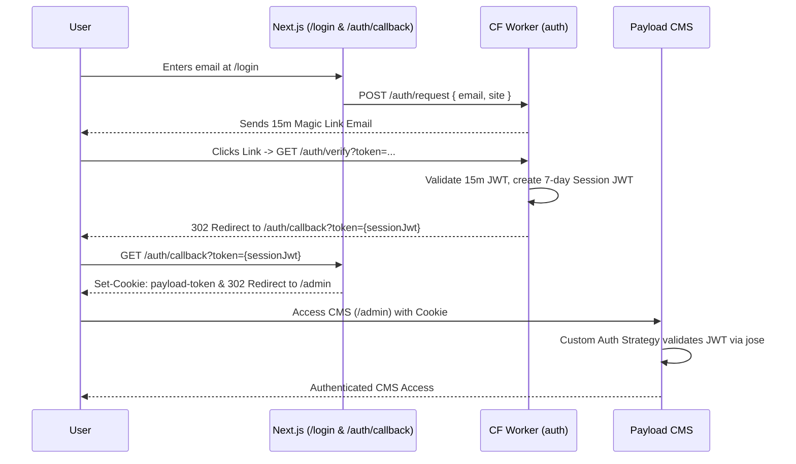

# Master-Auth Architecture

This document outlines the architecture for the stateless master-auth Cloudflare Worker and Payload CMS Custom Auth integration.

## Module Boundaries

```text
/auth (Cloudflare Worker)
  ├── POST /auth/request   # Sends Resend email w/ short-lived JWT
  └── GET  /auth/verify    # Verifies link, redirects to callback w/ 7-day JWT

/aniketpatidar (Next.js + Payload)
  ├── src/app/(frontend)/login/
  │     └── LoginForm.tsx          # Custom UI posting directly to Worker
  ├── src/app/(frontend)/auth/callback/
  │     └── route.ts               # Captures JWT from URL, sets HTTP-only Cookie
  └── src/collections/Users/
        └── index.ts               # Payload Strategy trusting the Worker's JWT
```

## End-to-End Authentication Control Flow



## Configuration Note
The Cloudflare Worker requires the following variables in its `wrangler.jsonc` (or as secrets in production) to properly validate sites:
- `ALLOWED_SITES` (e.g. `localhost:3000`)
- `FROM_ADDRESS` (e.g. `no-reply@aniketpatidar.com`)
- `JWT_SECRET` (Must match the `JWT_SECRET` used in Payload CMS)
