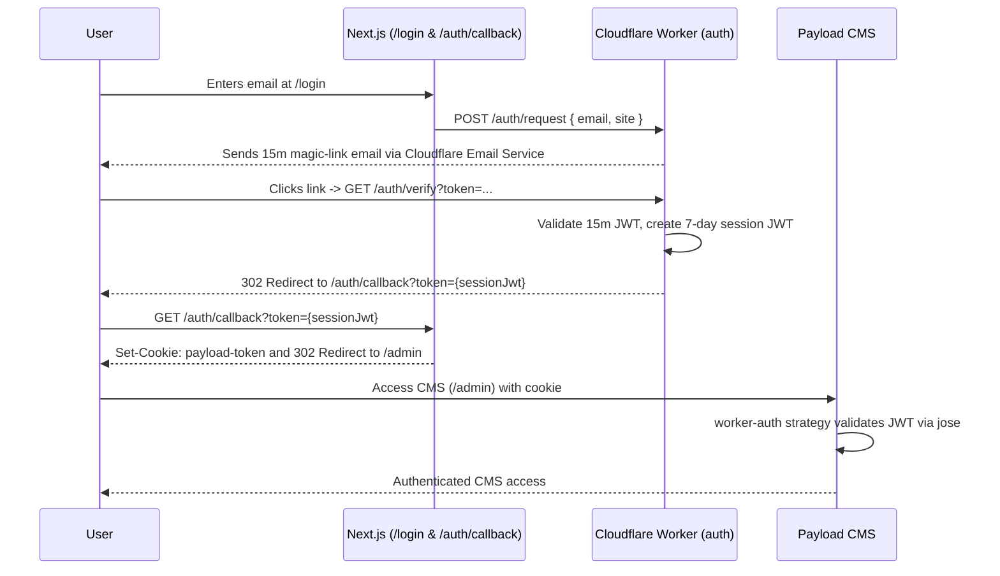

# Master-Auth Architecture

This document outlines the architecture for the stateless master-auth Cloudflare Worker and Payload CMS custom auth integration.

## Module Boundaries

    apps/master-auth (Cloudflare Worker)
      - src/index.ts
        - POST /auth/request: sends a Cloudflare Email Service message with a short-lived JWT
        - GET /auth/verify: verifies the link and redirects with a 7-day session JWT

    apps/web-cms (Next.js + Payload CMS)
      - src/app/(frontend)/login/LoginForm.tsx: posts the email and site to the Worker
      - src/app/(frontend)/auth/callback/route.ts: captures the session JWT and sets the Payload cookie
      - src/payload/collections/Users/index.ts: worker-auth strategy validates the session JWT

## End-to-End Authentication Control Flow

## Configuration Note

The auth Worker requires these variables in apps/master-auth/wrangler.jsonc or as production secrets:

- ALLOWED_SITES, for example localhost:3000
- FROM_ADDRESS, for example no-reply@aniketpatidar.com
- JWT_SECRET, which must match the JWT_SECRET used by the Payload worker-auth strategy

The CMS login form also requires NEXT_PUBLIC_AUTH_WORKER_URL, which points to the deployed Worker or the local Wrangler server. The Worker uses the MAGIC_LINKS_KV KV namespace for one-time link nonces and the EMAIL binding for delivery. The CMS uses PAYLOAD_SECRET for Payload itself; it is separate from JWT_SECRET.
